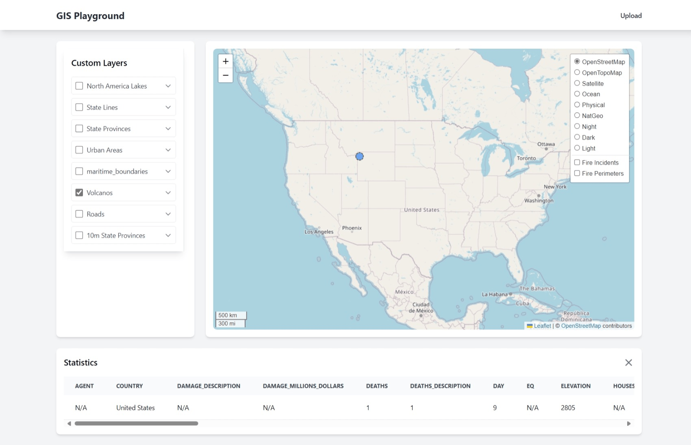

# GIS Playground

GIS Playground is a comprehensive web-based GIS application that combines multiple data sources and provides advanced spatial data visualization and analysis capabilities. The application features real-time wildfire data integration, intelligent spatial data processing, and interactive mapping functionality, making it a versatile tool for geographic data exploration and analysis.



## Features

### Data Integration
- Real-time wildfire data from ESRI's feature services
- Support for multiple spatial file formats:
    - Shapefiles
    - GeoJSON
    - CSV (with spatial coordinates)
    - GeoPackage
- Custom Layer visualization
- Multiple base map options

### Intelligent Processing
- AI-assisted layer naming and description generation
- Automated data quality analysis
- Spatial clustering for large datasets
- Smart attribute analysis and validation

### Data Management
- Automated CRS standardization
- Geometry validation and repair
- Multi-layer GeoPackage support
- Comprehensive error handling and validation

### Visualization
- Interactive map interface
- Dynamic layer toggling
- Feature property inspection
- Custom styling options

## Prerequisites

- Python 3.8+
- PostgreSQL with PostGIS extension
- GDAL/OGR libraries

## Installation

1. Clone the repository:
```bash
git clone https://github.com/yourusername/gis-playground.git
cd gis-playground
```

2. Create and activate a virtual environment:
```bash
python -m venv venv
source venv/bin/activate  # On Windows: venv\Scripts\activate
```

3. Install required packages:
```bash
pip install -r requirements.txt
```

## Project Structure

- `app/`: Source code directory
    - `database/`: Data processing and management
    - `models/`: API interaction
    - `routes/`: API interaction
    - `static/`: Static files (CSS, JS, Images)
    - `templates/`: HTML templates
    - __init__.py: Package initialization
- `config/`: Configuration files
- `data/`: Raw and processed data storage
- `logs/`: Log files
- `processors/`: Data processing scripts
    - File type-specific processors (Shapefile, CSV, GeoJSON, GeoPackage)
- `tools/`: Geoprocessing tools
    - `validation/`: Geometry and attribute validation
    - `conversion/`: CRS and format conversion
    - `analysis/`: Spatial analysis tools
    - `ai/`: AI-assisted processing tools
- `utils/`: Utility functions
- `requirements.txt`: List of dependencies
- `README.md`: Project documentation
- `manage.py`: Database management commands
- `run.py`: Main Flask application

## Key Components

### Data Processors
- Shapefile Processor: Handles ESRI Shapefile processing
- CSV Processor: Processes CSV files with spatial coordinates
- GeoJSON Processor: Manages GeoJSON file processing
- GeoPackage Processor: Handles multi-layer GeoPackage files

### Tools
- Geometry Validation: Ensures spatial data integrity
- CRS Conversion: Standardizes coordinate reference systems
- Smart Processing: AI-assisted data analysis and naming

## Usage

1. Start the Flask development server:
```bash
python run.py
```

2. Open your web browser and navigate to `http://localhost:5000`

3. Upload spatial data through the interface:
    - Supports multiple file formats
    - Automatic processing and validation
    - AI-assisted naming and description
    - Quality analysis reporting

## Future Enhancements

- Census data integration
- Advanced spatial analysis tools
- Custom styling interface
- Batch processing capabilities
- Enhanced AI features

## Acknowledgments

- ESRI for real-time wildfire data
- OpenStreetMap contributors
- Leaflet.js community
- GDAL/OGR project

## Additional Resources

- [Leaflet Documentation](https://leafletjs.com/reference.html)
- [PostGIS Documentation](https://postgis.net/documentation/)
- [GDAL/OGR Documentation](https://gdal.org/api/index.html)
- [Leaflet Providers](https://leaflet-extras.github.io/leaflet-providers/preview/)