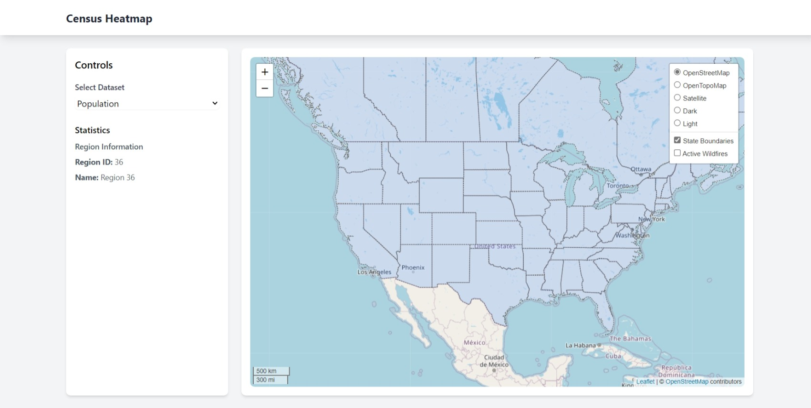

# Census Data Heatmap

An interactive web application that visualizes U.S. Census demographic data through dynamic heatmaps and choropleth maps.



## Features

- Interactive heatmap/choropleth visualization of demographic data
- Region comparison tools
- Dynamic data filtering
- Custom query builder
- Detailed region statistics

## Prerequisites

- Python 3.8+
- Census API key
- Natural Earth Data files

## Installation

1. Clone the repository:

```bash
git clone https://github.com/yourusername/census-heatmap.git
cd census-heatmap
```

2. Create and activate a virtual environment:

```bash
python -m venv venv
source venv/bin/activate  # On Windows: venv\Scripts\activate
```

3. Install required packages:

```bash
pip install -r requirements.txt
```

4. Set up your Census API key:

    - Create a copy of `config/config.example.py` as `config/config.py`
    - Add your Census API key to the configuration file

## Project Structure

- `app.py`: Main Flask application
- `src/`: Source code directory
    - `api/`: Census API interaction
    - `data/`: Data processing and management
    - `visualization/`: Map generation and visualization
- `static/`: Static files (CSS, JavaScript, images)
- `templates/`: HTML templates
- `data/`: Raw and processed data storage
- `config/`: Configuration files

## Usage

1. Start the Flask development server:
```bash
python app.py
```

2. Open your web browser and navigate to `http://localhost:5000`

## Contributing

1. Fork the repository
2. Create a feature branch
3. Commit your changes
4. Push to the branch
5. Create a Pull Request

## Acknowledgments

- U.S. Census Bureau for providing the API
- Natural Earth Data for boundary files

## Additional Resources

- [Natural Earth Data](https://www.naturalearthdata.com/)
- [Census Data API](https://api.census.gov)
- [Leaflet Providers](https://leaflet-extras.github.io/leaflet-providers/preview/)